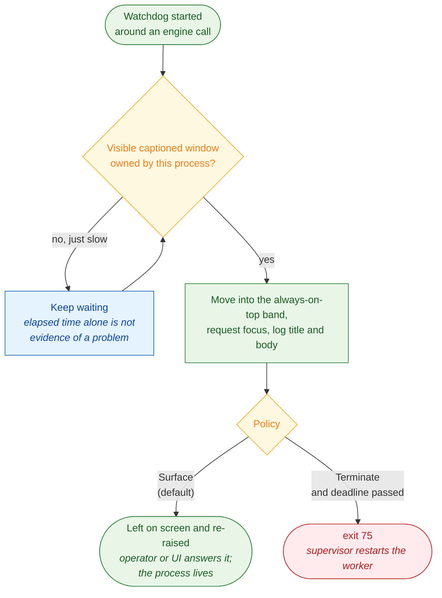
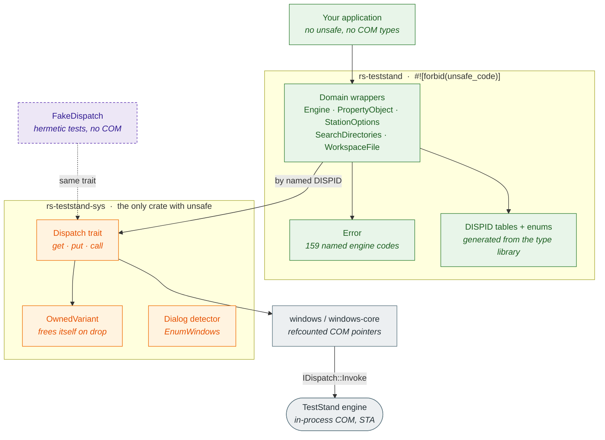

# 🦀 rs-teststand

[](https://crates.io/crates/rs-teststand)
[](https://docs.rs/rs-teststand)
[](LICENSE)
[](https://www.microsoft.com/windows)
[](https://doc.rust-lang.org/edition-guide/rust-2024/index.html)
[](https://www.ni.com/docs/en-US/bundle/teststand/page/year-based-and-major.html)

Community Rust language bindings for the [National Instruments TestStand™ COM API][ts-api]. A twin API, and the sibling of my other project, [`py-teststand`](https://github.com/TheDomcio/py-teststand).

## 📖 Overview

`rs-teststand` exposes the [TestStand™ COM API][ts-api] as a safe, idiomatic Rust interface built on late-bound [`IDispatch`][idispatch] invocation.

The COM object model is class-based and shaped by inheritance. I decided early not to imitate that in Rust, because faking a class hierarchy with traits would make the crate harder to read than the thing it wraps. Every COM interface is a plain struct that owns its dispatch handle, and richer behavior comes from composition: [`Engine`][ts-engine] hands you for example: [`StationOptions`][ts-stationoptions], a [`SequenceFile`][ts-sequencefile], a [`WorkspaceFile`][ts-workspacefile], each a self-contained value with its own lifetime. No base class, no shared mutable parent, no trait pretending to be inheritance.

What you get instead is what Rust is actually good at. Ownership makes the release path impossible to forget, [`Drop`](https://doc.rust-lang.org/std/ops/trait.Drop.html) handles COM teardown, HRESULTs arrive as typed errors, and bit masks are [`bitflags`](https://docs.rs/bitflags) types rather than loose integers. Method names still track the COM API one for one, so the call stays predictable. Only the shape around them is Rust's.

The public API surface maps one-to-one onto the TestStand™ object model: type names, the containment relationships between them, method names, and parameter order follow the COM API, so anyone who knows TestStand™ can predict the Rust call.

### 🐍 Similarity to py-teststand

I wrote [`py-teststand`](https://github.com/TheDomcio/py-teststand) before for easly integration with Python ecosystem toolings / remote executions management.

So why [re]write the whole thing again in Rust, the next language ecosystem and philosophy?

COM interop is a domain where things go wrong quietly.
A [wrong dispatch identifier](https://learn.microsoft.com/en-us/windows/win32/api/oaidl/nf-oaidl-idispatch-invoke) calls the wrong function and reports success. A [forgotten `Release`](https://learn.microsoft.com/en-us/windows/win32/com/managing-object-lifetimes-through-reference-counting) leaks a COM object. A [call from the wrong thread](https://learn.microsoft.com/en-us/windows/win32/com/processes--threads--and-apartments) corrupts state with no immediate symptom. Python lets you move fast over COM, but as a dynamically typed, interpreted language, it cannot prevent these mistakes at the language level.

Rust catches a useful share of these at compile time:

- **[Ownership](https://doc.rust-lang.org/book/ch04-01-what-is-ownership.html) prevents resource leaks.** Every COM reference releases on drop, so an early return or a panic on an error path cannot leak it. This crate had exactly that bug once: BSTRs and COM references leaked on the `call` conversion-error path because a hand-written `VariantClear` was an obligation that early returns silently skipped. The fix was `OwnedVariant`, a guard type whose `Drop` clears unconditionally. That class of bug is now structurally impossible, not just tested-for.
- **Thread safety is enforced by the compiler.** The wrapper types are [`!Send` and `!Sync`](https://doc.rust-lang.org/book/ch16-04-extensible-concurrency-sync-and-send.html), so calling the engine from the wrong thread is a compile error, not a race condition discovered in production. COM Single-Threaded Apartment rules are hard to remember and easy to violate; the type system remembers for you.
- **The [unsafe](https://doc.rust-lang.org/book/ch19-01-unsafe-rust.html) boundary is verifiable.** The public crate enforces `#![forbid(unsafe_code)]`. All raw pointer and VARIANT work lives in a separate `-sys` crate, so the compiler proves the public surface contains no unsafe, rather than taking the claim on trust.

This approach simplifies deployment in four ways:

- **Cross-targeting reaches old stations.** The same source builds for 32-bit and 64-bit Windows against engines from [TestStand™ 2016 through TestStand™ 2026 Q1][ts-versions], because dispatch goes through dispatch identifiers I verified stable across that range.
- **Deployment is vastly simpler.** Because Rust is an [ahead-of-time compiled language](https://doc.rust-lang.org/book/ch01-02-hello-world.html#anatomy-of-a-rust-program), it produces a single, self-contained binary executable. In contrast, Python is an [interpreted language](https://docs.python.org/3/tutorial/interpreter.html), which requires shipping the Python runtime, managing virtual environments, and installing dependencies on the target machine. On a locked-down production station, installing a Python environment is an enormous friction point.
- **The footprint stays extremely small.** A compiled Rust host is tiny and highly optimized, dropping cleanly onto a machine with zero runtime overhead (see Rust's design for [zero-cost abstractions](https://doc.rust-lang.org/book/ch00-00-introduction.html)). Python environments and their dependencies can easily consume hundreds of megabytes. This matters on a production station, where the point of the machine is the test rig and not the software bolted onto it.
- **There is almost nothing to pull in.** No C or C++ toolchain at build time, no vendored type libraries, no code generation on your machine.

These technology options allow exposing the engine over whatever the Rust ecosystem already speaks, like [gRPC](https://grpc.io/), a message queue, or plain HTTP.

The watchdog belongs to the same goal rather than being a separate feature. A [message popup][ts-messagepopup] step blocks the calling thread inside COM, and that is fatal two different ways: to a service with nobody there to answer, and to an operator-facing host if the question never reaches the screen. The guard covers both. By default it puts the popup in front of every other window so a user interface or a person can answer it, and the process lives; terminating on a dialog instead is a choice you make for a host that genuinely runs alone. This matters most when driving sequences someone else already wrote, which is where these steps turn up unannounced. See [Dialogs and the watchdog](#️-dialogs-and-the-watchdog).

### 🏷️ Name

The package is named `rs-teststand` (with a dash), referencing its sibling project [`py-teststand`](https://github.com/TheDomcio/py-teststand), to avoid naming collision with the Rust `test` framework and for easier relation to the TestStand™ test executive. The import name uses an underscore: `rs_teststand`.

### 🏗️ Technical stack

#### [`rs-teststand`](./crates/rs-teststand)

| Tool / Crate                                                                                                | Purpose                                            |
| :---------------------------------------------------------------------------------------------------------- | :------------------------------------------------- |
| **[`Cargo`](https://doc.rust-lang.org/cargo/)**                                                             | Package management, build system, and workspaces   |
| **[`windows-core`](https://crates.io/crates/windows-core) / [`windows`](https://crates.io/crates/windows)** | Official Microsoft Win32 COM primitives (`0.62.2`) |
| **[`thiserror`](https://crates.io/crates/thiserror)**                                                       | Type-safe error handling and HRESULT mapping       |
| **[`bitflags`](https://crates.io/crates/bitflags)**                                                         | Type-safe bitmask flags                            |
| **[`clippy`](https://github.com/rust-lang/rust-clippy)**                                                    | Workspace deny-wall                                |
| **[`rustfmt`](https://github.com/rust-lang/rustfmt)**                                                       | Code formatting standard                           |

#### [`rs-teststand-serde`](./crates/rs-teststand-serde)

| Tool / Crate                                  | Purpose                                        |
| :-------------------------------------------- | :--------------------------------------------- |
| **[`serde`](https://crates.io/crates/serde)** | Serialization and deserialization of the trees |

#### [`rs-teststand-bridge`](./crates/rs-teststand-bridge)

| Tool / Crate                                  | Purpose                                 |
| :-------------------------------------------- | :-------------------------------------- |
| **[`tokio`](https://crates.io/crates/tokio)** | Asynchronous runtime backing the server |
| **[`tonic`](https://crates.io/crates/tonic)** | gRPC over HTTP/2 implementation         |
| **[`prost`](https://crates.io/crates/prost)** | Protocol Buffers implementation         |

## ⚠️ Transparency

### 🚧 Project status

This is a hobby project, maintained on a best-effort basis and **not** yet
under active full-time development ahead of the first release. There is no fixed release
schedule or formal support, but feel free to get in touch.

Treat it as experimental: wrapper behaviour may change between releases without notice.

If you hit a missing TestStand™ binding, a wrong dispatch identifier, or unexpected
TestStand™ COM dispatch behavior, open an issue with a reproducible case. That is the
best way to get it fixed.

For now I prefer lightweight tags based releases (I protected them in repository settings)
instead of fully described ones until reach 1.0.0 release.

### 🤖 AI-assisted development

This project leverages Large Language Models (LLMs) to assist with:

- **Codebase audits** and refactoring.
- **Test coverage analysis** and generation.
- **Documentation drafting**.
- **Type library validation** and cross-checking.

This is an independent community project. These AI tools are used to optimize
productivity and are **not** an official component of the project, nor do they integrate
with or replace the official [NIGEL™ AI Advisor](https://www.ni.com/en/shop/software-portfolio/nigel.html) provided by National Instruments. All generated code is manually reviewed by the
maintainer to ensure it meets the project's quality standards. The failure mode here is not a compile error: a wrong dispatch identifier is usually a valid member of the same interface, so a bad guess calls the wrong function and reports success.

---

## ⚡ Quick start

Add `rs-teststand` to your project:

```text
cargo add rs-teststand
```

The extensions are separate, and optional:

```text
cargo add rs-teststand-serde   # property trees as JSON
cargo add rs-teststand-bridge    # serve the engine to other processes
```

Drive the TestStand™ engine from Rust:

```rust
use rs_teststand::Engine;

fn main() -> Result<(), rs_teststand::Error> {
    // Initializes the STA COM apartment and creates the TestStand engine
    let engine = Engine::new()?;

    println!("TestStand Major Version: {}", engine.major_version()?);
    println!("TestStand Version String: {}", engine.version_string()?);
    println!("Engine 64-bit Process: {}", engine.is_64bit()?);
    println!("TestStand Root Directory: {}", engine.teststand_directory()?);

    Ok(())
    // Engine COM reference is safely released on drop
}
```

> A live TestStand™ installation is only required at runtime when COM objects are actually instantiated, not at compile time.

---

## 💡 Examples

The `rs-teststand` workspace includes a comprehensive suite of executable examples. They are meant to be run against a live engine to demonstrate how to perform common tasks idiomatically.

You can run any example from the workspace root using `cargo run --example <name>`:

```text
cargo run -p rs-teststand --example execution_run_test_headless
```

| Example                       | Purpose                                                                    |
| :---------------------------- | :------------------------------------------------------------------------- |
| `execution_run_test_headless` | Run a sequence headless and wait for completion.                           |
| `execution_run_subsequence`   | Pass arguments to a subsequence and read out the results.                  |
| `variables_manage`            | Read and write Locals, Parameters, and FileGlobals.                        |
| `ui_messages_handle`          | Start an execution and pump UI messages in a loop without a GUI.           |
| `step_insert`                 | Create a Sequence, populate it with new steps, and configure properties.   |
| `step_insert_from_template`   | Instantiate pre-configured steps from a template file.                     |
| `template_manage_complex`     | Build a custom step template programmatically and save it.                 |
| `search_directory_manage`     | Enumerate and modify the engine's search directories.                      |
| `users_manage`                | Create a User, assign privileges, and read the station's users file.       |
| `data_type_manage`            | Query and modify custom data types.                                        |
| `workspace_create`            | Create a `.tsw` workspace and add a sequence file to it.                   |
| `result_list_parse`           | Walk an execution's ResultList to extract pass/fail status and step times. |
| `station_options_update`      | Safely modify station options (like disabling modal dialogs).              |

| `version_print`               | Open the engine and report its version, bitness and install directory.     |

You can run them all in sequence using the launcher:

```text
cargo run -p rs-teststand --example launch_all_examples
```

### 🚀 Building an application

The examples above show the API. They do not show what a deployed host *costs*, because that answer lives in your own `Cargo.toml` rather than in the crate. A Cargo profile is only honoured in the package that is the build root, so a library cannot set one for you.

[`examples/version-printer/`](examples/version-printer) is a complete standalone application for exactly that: open the engine, print its version, exit. Copy the directory, drop the `path` from the dependency, and it builds anywhere. It is not a workspace member and is marked `publish = false`, so it never reaches crates.io.

Measured on `x86_64-pc-windows-msvc` against a registered 2026 Q1 engine:

| build                              |    size | needs installed alongside  |
| :--------------------------------- | ------: | :------------------------- |
| stock `cargo build --release`      | 162 KiB | `VCRUNTIME140.dll`, UCRT   |
| size-oriented profile              | 118 KiB | `VCRUNTIME140.dll`, UCRT   |
| size-oriented profile + static CRT | 213 KiB | nothing but Windows itself |

The last row is the one to care about for deployment. A default Rust MSVC binary links the C runtime dynamically, so it needs the Visual C++ redistributable and a Universal CRT that Windows 7 does not carry by default. Linking the CRT statically costs 95 KiB and leaves an import table holding only `ole32`, `oleaut32`, `kernel32`, `ntdll` and a synchronisation stub, all of which ship with Windows. That leaves one file to copy onto a locked-down station, with the engine as the only other requirement. Its [README](examples/version-printer/README.md) explains each knob and what it buys.

---

## ✨ Features

- **Rust 2024 Edition**: built on [Edition 2024](https://doc.rust-lang.org/edition-guide/rust-2024/index.html) (Rust 1.85+), Cargo [`resolver = "3"`](crates/../Cargo.toml), and a workspace-wide [deny-wall](Cargo.toml) that forbids panics, stubs, unchecked indexing, and undocumented unsafe at the lint level.
- **Zero unsafe in the public surface**: the [`rs-teststand`](crates/rs-teststand/src/lib.rs) crate enforces [`#![forbid(unsafe_code)]`](crates/rs-teststand/src/lib.rs). All COM interop lives in the separate [`rs-teststand-sys`](crates/rs-teststand-sys) crate; the compiler proves the public crate contains none.
- **Twin API design**: containment relationships, method names, and parameter order follow the COM API (`NewExecution` -> `new_execution`). The surface is composed Rust types, not an inheritance hierarchy. See the [Architecture](#-repository-structure) section.
- **Self-contained package**: no C/C++ compiler at build time, no vendored type libraries, no consumer-side code generation. `cargo add rs-teststand` is enough.
- **Cached DISPID late-binding**: method calls dispatch via pre-cached [dispatch IDs](crates/rs-teststand/src/dispids.rs) verified identical across [TestStand™ 2016 through TestStand™ 2026 Q1][ts-versions] (zero mismatches over 3 907 member pairs in [six type-library dumps](PLAN.md)).
- **Masks as typed flags, not bare integers**: the engine takes a `Long` and asks callers to combine named constants with bitwise-OR. This crate keeps the engine's exact numbering but wraps each mask in a [`bitflags`](https://docs.rs/bitflags) type ([`PropertyOptions`](crates/rs-teststand/src/property/options.rs), [`GetSeqFileOptions`](crates/rs-teststand/src/sequence/options.rs), [`DebugOptions`](crates/rs-teststand/src/station/debug_options.rs), [`ExecutionMask`](crates/rs-teststand/src/station/execution_mask.rs), [`PropertyValueTypeFlags`](crates/rs-teststand/src/enums.rs)), so options combine with `|`, read back with `contains`, and cannot be mixed with an unrelated mask. Unknown bits set by a newer engine survive a read-modify-write.
- **Apartment safety**: wrapper types are non-`Send` / non-`Sync` because they hold a [`Box<dyn Dispatch>`](crates/rs-teststand-sys/src/dispatch.rs) backed by the `windows` crate's `IDispatch`, which is itself `!Send + !Sync`. Calling the engine from the wrong thread is a compile error.
- **Named engine error codes**: a generated [lookup table](crates/rs-teststand/src/error_codes.rs) maps raw HRESULTs to names like `TS_Err_OutOfMemory`, so a failure message says _what_ went wrong instead of printing a bare number.
- **Execution, Thread, SequenceContext**: run a sequence, wait for it, inspect per-thread state and variable scopes. [`Execution`][ts-execution], [`Thread`][ts-thread], [`SequenceContext`][ts-sequencecontext], and `ResultList` are implemented.
- **UI message polling without a GUI**: a [`UIMessage`][ts-uimessage] type with [45 named codes](crates/rs-teststand/src/messaging/ui_message_code.rs) and a [`pump_thread_messages`](crates/rs-teststand/src/messaging/pump.rs) helper for headless hosts.
- **Step and template building**: [`Step`][ts-step], [`Sequence`][ts-sequence], and [`SequenceFile`][ts-sequencefile] wrappers support building sequences, inserting steps from templates, and reading results.
- **User management**: [`User`][ts-user] and `Privilege` wrappers for creating users and setting their privileges.
- **Popups reach the operator, not the killer**: the engine's own dialogs are switched off at startup, but a [message popup][ts-messagepopup] step is a question a sequence means to ask. A [`Watchdog`](crates/rs-teststand/src/watchdog.rs) finds it and puts it in front of every other window, including always-on-top ones from another process, so a user interface can still answer it. Terminating on a dialog is opt-in, for hosts that genuinely have nobody there. See [Dialogs and the watchdog](#️-dialogs-and-the-watchdog).
- **Variables as JSON** ([`rs-teststand-serde`](crates/rs-teststand-serde)): a [`PropertyObject`][ts-propertyobject] tree round-trips through plain JSON, with 64-bit representations kept exact, non-finite numbers as `null`, radix formats preserved, multidimensional arrays nested.
- **Clean-room compliance**: original Rust documentation; no copied National Instruments manual prose. Documentation links reside strictly in [`Cargo.toml`](Cargo.toml) package metadata.

### ⚙️ Engine management

[`Engine`](crates/rs-teststand/src/engine.rs) is the root of the object model and the only object created through ActiveX; every other wrapper is produced by it. The module covers three things: getting an engine into a usable state, getting rid of one cleanly, and surviving the dialogs a sequence can raise in between.

**Construction.** `Engine::new` initialises a single-threaded COM apartment and creates the version-independent `TestStand.Engine` coclass, then does two things the sequence editor would otherwise have done:

- **Station dialog options go to their non-interactive settings** for the session: run-time errors abort instead of prompting; the file-search, check-out, source-control and type-version prompts are off; user login is not required; and the two debug bits that pop a dialog during shutdown are cleared. Leak _detection_ is untouched, only the modal report. Failures here are ignored on purpose, because a hardening step must never stop an engine from being created.
- **Type palettes are loaded.** Step types live in the palettes, and an engine created directly over COM does not load them, so `new_step` would otherwise fail with `TS_Err_StepTypeNotFound` for every built-in type.

**Teardown.** Dropping an `Engine` releases the COM object. `shutdown` is the graceful path: `Engine.ShutDown` is asynchronous, returning as soon as the request is accepted while executions are still terminating, so the wrapper turns on message polling, asks for shutdown, then pumps and drains the queue until the engine posts `UIMsg_ShutDownComplete` or the timeout runs out. `close` does that and then closes the apartment, releasing the engine _before_ uninitialising COM rather than after.

**The rest of the surface** follows the object model: version and directory queries, [station options][ts-stationoptions], search directories, station globals, and the factories for sequence files, executions, steps, sequences, users, property objects and workspace files.

#### 🛡️ Dialogs and the watchdog

The engine runs in-process on a single-threaded COM apartment. When a dialog goes up, the calling thread is stuck _inside_ COM: the call does not return, so there is nothing to time out and no Rust code can cancel it. Construction removes the dialogs the engine raises on its own, but it cannot remove the ones a sequence asks for, and it should not — a [message popup][ts-messagepopup] step exists to stop and ask a person something.

So the guard's job is to make sure the question is **seen**, not to make the process die for it:

```rust
use std::time::Duration;
use rs_teststand::Watchdog;

let guard = Watchdog::start(Duration::from_secs(30), "running MainSequence");
// ... engine call that may stop on a popup ...
drop(guard); // done; the call returned
```



**Surfacing.** Windows sorts windows into an ordinary band and an always-on-top band. The dialog is moved into the second one, which puts it above every ordinary window, and re-asserting that on each poll also moves it to the front _of_ that band, so an always-on-top front end in another process cannot bury it. Focus is requested as well, but it is the weaker half: Windows grants the foreground only under conditions it decides, and a refusal is reported rather than papered over. Z-order is the guarantee; focus is best effort.

**Detection is by shape, not by class.** Any visible, non-minimised, captioned top-level window this process owns counts. Matching the standard dialog class `#32770` was tried first and misses the case that matters: measured against a live engine, a message popup step produces a captioned overlapped window from the runtime the engine's user interface is built on, whose owner stays _enabled_, so neither the dialog class nor the usual Win32 modality signature identifies it. The cost of the broad rule is that a host with windows of its own in the same process matches those too — harmless under surfacing, which only reorders windows, and a reason not to pair a graphical host with the terminating policy.

**Terminating** is opt-in via `Watchdog::start_with` and `DialogPolicy::Terminate`, for a host that truly has nobody to answer. It needs **both** the deadline passed **and** a dialog present, because elapsed time alone is not evidence: a real sequence can legitimately sit for many minutes on a popup step or a long test. When it does fire, the dialog's title and body go to `stderr` before the process exits with code `75`, a distinct code so a supervisor can tell "stuck" from "returned an error". Capturing the text matters: `engine error TS_Err_...` is actionable, "the process died" is not. Termination is blunt because it is the only exit from a blocked apartment, so anything that must survive it should run the engine in a **worker process** and let the supervisor restart it.

---

## 🧩 Compatibility

| Component             | Supported                                                                                                                                     |
| :-------------------- | :-------------------------------------------------------------------------------------------------------------------------------------------- |
| **Operating system**  | Windows (32-bit and 64-bit). Windows 7 requires the [`*-win7-windows-msvc`][win7-msvc] tier 3 targets, see [below](#-building-for-windows-7). |
| **Rust toolchain**    | [1.85+ (Edition 2024)](https://doc.rust-lang.org/edition-guide/rust-2024/index.html)                                                          |
| **TestStand™ engine** | [TestStand™ 2016 through TestStand™ 2026 Q1][ts-versions]                                                                                     |

### 🪟 Building for Windows 7

Rust raised the baseline for the tier 1 `*-pc-windows-*` targets to Windows 10
in 1.78 ([Updated baseline standards for Windows targets][win-baseline]). A
binary built the ordinary way will not run on Windows 7.

Windows 7 outlives its support dates in test labs, so Rust added separate
targets with a Windows 7 baseline ([`*-win7-windows-msvc`][win7-msvc]). They
are [tier 3][tiers], so rustup ships no prebuilt standard library and you need
a nightly toolchain with `build-std`:

```text
rustup toolchain install nightly --component rust-src
cargo +nightly build -Z build-std=std,panic_abort --target x86_64-win7-windows-msvc -p rs-teststand
cargo +nightly build -Z build-std=std,panic_abort --target i686-win7-windows-msvc -p rs-teststand
```

I have built both against this repository. The 32-bit target matters most in
practice: old stations tend to be 32-bit and old at the same time, which is
exactly the combination this crate is meant to reach. I have not executed on a
Windows 7 machine with a TestStand™ engine; if you have one, I would like to
hear how it goes.

[ts-api]: https://www.ni.com/docs/en-US/bundle/teststand-api-reference/page/tshelp/teststand-api-reference.html
[ts-versions]: https://www.ni.com/docs/en-US/bundle/teststand/page/year-based-and-major.html
[win-baseline]: https://blog.rust-lang.org/2024/02/26/Windows-7/
[win7-msvc]: https://doc.rust-lang.org/rustc/platform-support/win7-windows-msvc.html
[tiers]: https://doc.rust-lang.org/rustc/target-tier-policy.html
[ts-engine]: https://www.ni.com/docs/en-US/bundle/teststand-api-reference/page/tsapiref/engine.html
[ts-stationoptions]: https://www.ni.com/docs/en-US/bundle/teststand-api-reference/page/tsapiref/stationoptions.html
[ts-sequencefile]: https://www.ni.com/docs/en-US/bundle/teststand-api-reference/page/tsapiref/sequencefile.html
[ts-workspacefile]: https://www.ni.com/docs/en-US/bundle/teststand-api-reference/page/tsapiref/workspacefile.html
[ts-execution]: https://www.ni.com/docs/en-US/bundle/teststand-api-reference/page/tsapiref/execution.html
[ts-thread]: https://www.ni.com/docs/en-US/bundle/teststand-api-reference/page/tsapiref/thread.html
[ts-sequencecontext]: https://www.ni.com/docs/en-US/bundle/teststand-api-reference/page/tsapiref/sequencecontext.html
[ts-uimessage]: https://www.ni.com/docs/en-US/bundle/teststand-api-reference/page/tsapiref/uimessage.html
[ts-step]: https://www.ni.com/docs/en-US/bundle/teststand-api-reference/page/tsapiref/step.html
[ts-sequence]: https://www.ni.com/docs/en-US/bundle/teststand-api-reference/page/tsapiref/sequence.html
[ts-user]: https://www.ni.com/docs/en-US/bundle/teststand-api-reference/page/tsapiref/user.html

[ts-propertyobject]: https://www.ni.com/docs/en-US/bundle/teststand-api-reference/page/tsapiref/propertyobject.html
[idispatch]: https://learn.microsoft.com/en-us/windows/win32/api/oaidl/nn-oaidl-idispatch
[ts-messagepopup]: https://www.ni.com/docs/en-US/bundle/teststand-api-reference/page/tsref/message-popup-step.html

---

## 📦 Repository structure

Four crates in one repository. Start with `rs-teststand`. The `-sys` crate is an
implementation detail you never depend on directly, and the last two are optional
additions you can ignore until you need them.

| Crate                                             | crates.io                                                                                                           | Docs                                                                                           | What it is                                                                                                                                      |
| :------------------------------------------------ | :------------------------------------------------------------------------------------------------------------------ | :--------------------------------------------------------------------------------------------- | :---------------------------------------------------------------------------------------------------------------------------------------------- |
| [`rs-teststand`](crates/rs-teststand)             | [](https://crates.io/crates/rs-teststand)             | [](https://docs.rs/rs-teststand)             | The binding. A twin of the COM API and nothing else. This is the one you depend on.                                                             |
| [`rs-teststand-sys`](crates/rs-teststand-sys)     | [](https://crates.io/crates/rs-teststand-sys)     | [](https://docs.rs/rs-teststand-sys)     | The low-level COM interop layer. Every `unsafe` block in the workspace lives here. An implementation detail.                                    |
| [`rs-teststand-serde`](crates/rs-teststand-serde) | [](https://crates.io/crates/rs-teststand-serde) | [](https://docs.rs/rs-teststand-serde) | Property trees to and from JSON, or any serde format.                                                                                           |
| [`rs-teststand-bridge`](crates/rs-teststand-bridge)   | [](https://crates.io/crates/rs-teststand-bridge)   | [](https://docs.rs/rs-teststand-bridge)   | Serve the engine to other processes. Early; the host exists, the gRPC services do not yet. Unrelated to National Instruments' own gRPC project. |

All four share a version number and are published together.

The crates are published as `rs-teststand`, `rs-teststand-sys`,
`rs-teststand-serde` and `rs-teststand-bridge`, and imported with underscores,
because a hyphen cannot appear in a Rust identifier: `use rs_teststand::Engine;`.
Cargo does that translation itself, and crates.io treats `-` and `_` as the same
name, so only one spelling can exist. This is the split
[`py-teststand`](https://github.com/TheDomcio/py-teststand) already uses, where
the distribution is `py-teststand` and the import is `py_teststand`. The hyphen
is also what the `-sys` suffix convention expects for the crate holding the
low-level bindings, as in `windows-sys` and `openssl-sys`.



The `Dispatch` trait is the seam that makes both properties possible: real calls go
through `IDispatch::Invoke`, while tests substitute a fake and exercise the same
wrapper logic with no COM at all.

### ❓ Why split them?

**`-sys` split:** because it makes the safety claim _verifiable_ rather than aspirational.
`#![forbid(unsafe_code)]` is a crate-level guarantee: a single crate that both
contains `unsafe` and claims to forbid it can only use `deny` plus a local
`allow`, which any module can override. Splitting the `unsafe` into a separate
crate means the compiler proves the public crate contains none, the same
pattern the ecosystem uses for `windows-sys`/`windows` and `openssl-sys`/`openssl`.

Two caveats stated plainly:

- The `-sys` suffix conventionally denotes raw bindings that link a native
  library through a build script. This crate has no build script and links
  nothing directly; it builds on Microsoft's `windows` crate. The suffix marks
  it as _the low-level layer_, which is how it should be read.
- Its public items exist so the safe crate can use them. They are an
  implementation detail, not a supported API, depend on `rs-teststand`.

**Extension splits (`-serde`, `-grpc`):** because a dependency you cannot remove
is a cost you cannot opt out of. Serializing a property tree needs serde;
serving the engine over a network needs an async runtime and an RPC stack; using
the engine needs neither. Keeping them apart means the binding's dependency
graph stays small enough for the constrained, long-lived test stations this
targets, and each extension can move at its own pace without dragging the API it
wraps along.

It also keeps the twin API honest. `rs-teststand` mirrors TestStand™ and nothing
else, so no wire format and no transport ever leaks into a wrapper's shape, and
because an extension may only add _traits_, never inherent methods, the
distinction is enforced by the compiler rather than by discipline.

Consumers are unaffected by either split: `cargo add rs-teststand` resolves what
it needs from crates.io, with no build step, no vendored type library, and no
code generation on your machine.

---

## ⚖️ Legal

TestStand™ is a registered trademark of [National Instruments Corporation](https://www.ni.com). Refer to [National Instruments' TestStand™ licensing options](https://www.ni.com/docs/en-US/bundle/teststand/page/teststand-licensing-options.html) and [license selection guide](https://www.ni.com/en/shop/electronic-test-instrumentation/application-software-for-electronic-test-and-instrumentation-category/what-is-teststand/select-license.html) for information on required licenses to operate the TestStand™ engine.

The `rs-teststand-bridge` crate is not related to National Instruments
[ni/grpc-teststand-api](https://github.com/ni/grpc-teststand-api) project. It shares no code or
protocol definitions with it, and pursues a comparable goal for a different ecosystem and a wider
range of engine versions.

`rs-teststand` is an independent community project and is not affiliated with, endorsed by, or maintained by National Instruments.
References to the TestStand™ API are made solely for interoperability purposes. This project is licensed under the [MIT License](LICENSE).
